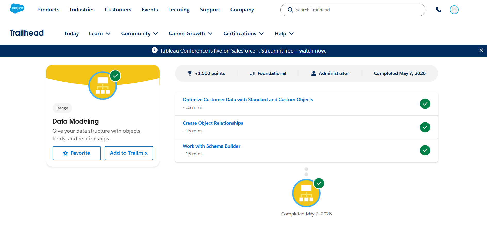
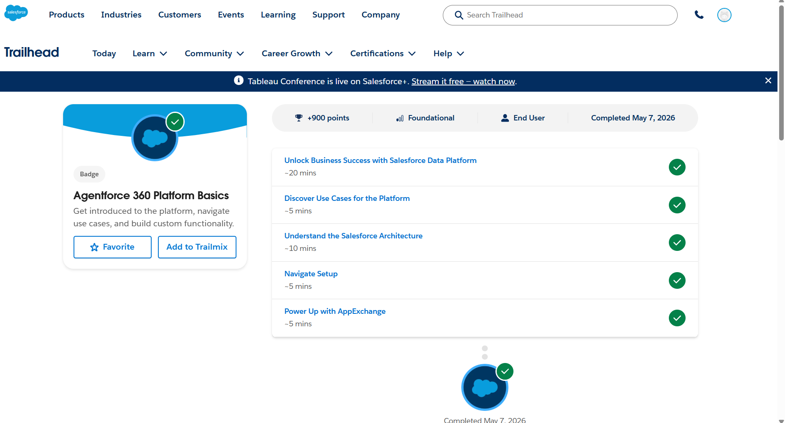
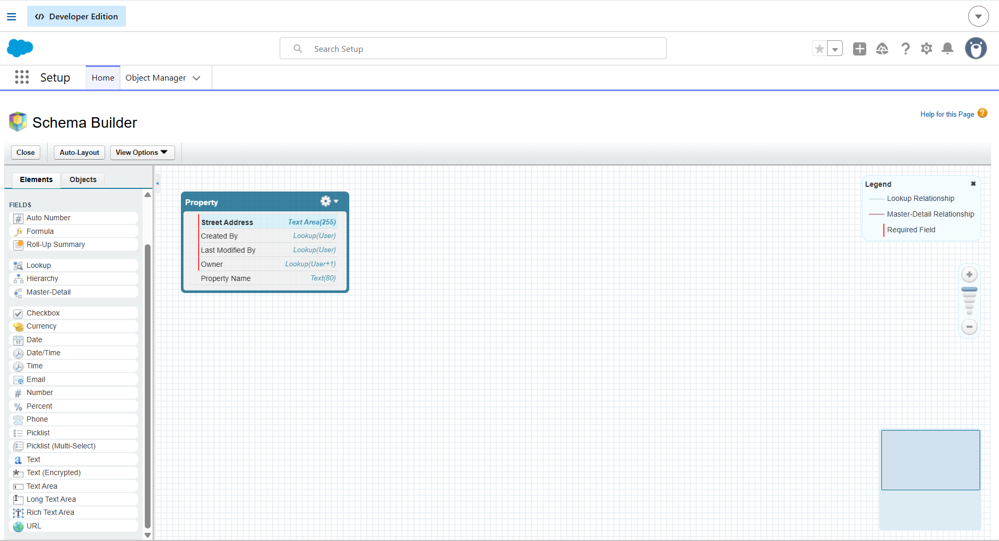
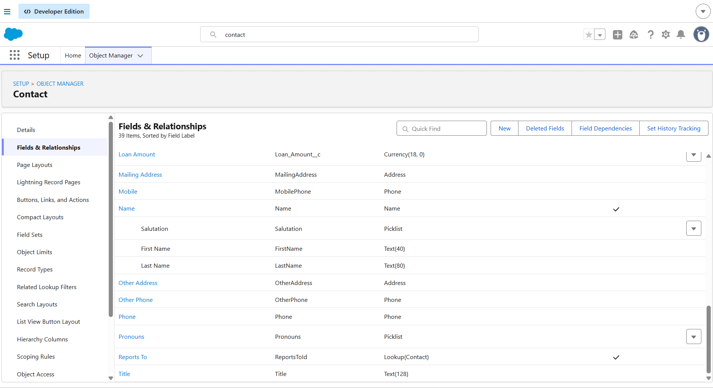
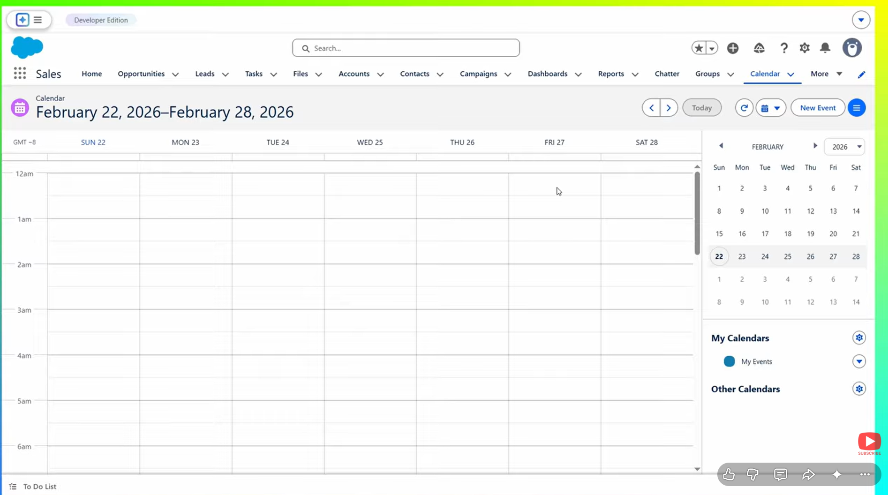

# Day 1 - CRM Basics

## 1. What is CRM?

CRM stands for Customer Relationship Management.
It helps companies manage customer data, sales, communication, and support in one platform.

## 2. Why Companies Use Salesforce

Companies use Salesforce to:
- Manage customer information
- Track sales and leads
- Improve customer support
- Automate business processes
- Increase productivity

## 3. Salesforce Objects

### Account
Represents a company or organization.
Example:
TCS, Infosys, Amazon

### Contact
Represents a person associated with an account.
Example:
Employee or customer details.

### Opportunity
Represents a potential sales deal.
Example:
A company interested in buying a software product.

## 4. Real-World Mapping
College Management System
Objects:
- Student
- Faculty
- Course
- Attendance
- Fees
## 5. Trailhead Screenshots

### Screenshot 1

### Screenshot 2

### Screenshot 3

### Screenshot 4

### Screenshot 5

## Learnings

- Learned what CRM is
- Understood Salesforce basics
- Learned about objects and records

## Doubts / Questions

- How are custom objects used in real companies?
- Difference between Admin and Developer?
