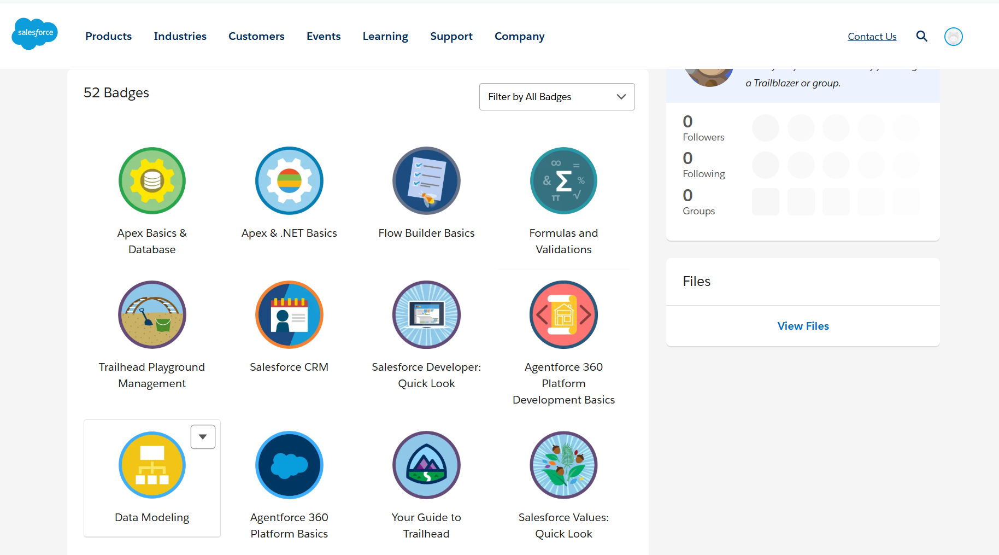
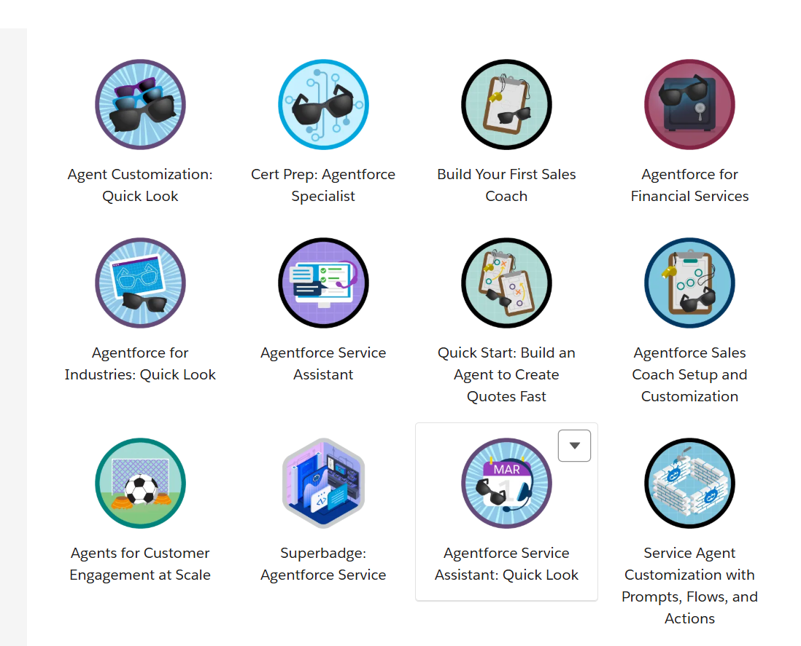
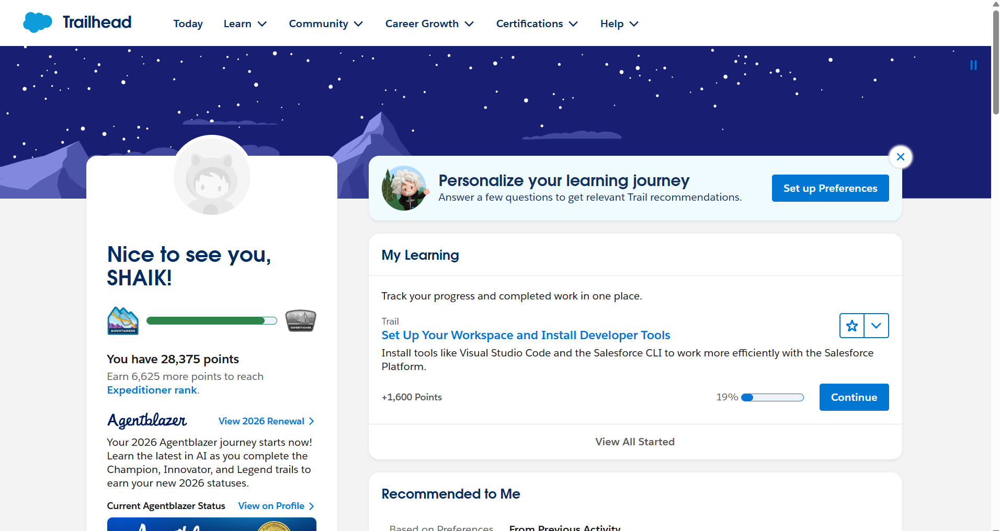

# Light Completion Day – Salesforce Summer Sprint

## Modules Completed

- Salesforce Values  
- Trailhead Playground Management  
- Salesforce Developer: Quick Look  
- Salesforce CRM  
- Agentforce 360 Platform Basics  
- Agentforce 360 Platform Developer  
- Agentforce 360 Platform Events  
- Apex & .NET Basics  
- Formulas and Validations  
- Data Modeling  
- Flow Builder Basics  
- Database & .NET Basics  
- Search Solution Basics  
- Command-Line Interface  
- Apex Basics & Database  
- Apex Triggers  

## One Learning from Each Module

### 1. Salesforce Values
Learned how Salesforce focuses on trust, customer success, innovation, equality, and sustainability.

### 2. Trailhead Playground Management
Learned how to create and manage Trailhead Playgrounds for hands-on Salesforce practice.

### 3. Salesforce Developer: Quick Look
Learned the role of a Salesforce Developer and how developers customize Salesforce using code and automation.

### 4. Salesforce CRM
Learned how Salesforce CRM helps businesses manage customer relationships, sales, and support processes.

### 5. Agentforce 360 Platform Basics
Learned the basics of the Agentforce platform and how it supports AI-powered customer experiences.

### 6. Agentforce 360 Platform Developer
Learned how developers can build and customize applications on the Agentforce platform.

### 7. Agentforce 360 Platform Events
Learned how platform events enable event-driven communication between systems asynchronously.

### 8. Apex & .NET Basics
Learned how Apex concepts are similar to object-oriented programming concepts in .NET.

### 9. Formulas and Validations
Learned how formulas automate calculations and validations enforce business rules on records.

### 10. Data Modeling
Learned how Salesforce stores data using objects, fields, and relationships.

### 11. Flow Builder Basics
Learned how Flow Builder automates business processes without writing code.

### 12. Database & .NET Basics
Learned how databases store and retrieve data using queries and DML operations.

### 13. Search Solution Basics
Learned how Salesforce search helps users quickly find records efficiently.

### 14. Command-Line Interface
Learned how developers use CLI tools to automate tasks and improve workflow speed.

### 15. Apex Basics & Database
Learned how Apex interacts with Salesforce databases using SOQL and DML statements.

### 16. Apex Triggers
Learned how triggers automatically execute logic when records are created, updated, or deleted.

## One Doubt / Question

How do enterprise projects decide when to use Flow, Apex Trigger, or Platform Events for automation?

## Platform Event Reflection

One real-life example:
When a student registers for a course, the system can automatically:
- Send confirmation email to the student
- Notify faculty members
- Update dashboards and analytics

This helps multiple systems stay synchronized automatically.

## CLI Reflection

Developers prefer command-line tools because they are faster, support automation, and integrate easily with development tools like Git and Salesforce CLI.

## Search Reflection

Fast and accurate search is important because enterprise systems contain huge amounts of data, and users need quick access to the correct records to improve productivity.

## One Doubt / Question

How do we decide the best combination of Flow, Trigger, and Platform Events in a real enterprise project?

## Screenshots of Trailhead Progress

### Screenshot 1
.png)

### Screenshot 2
.png)

### Screenshot 3

### Screenshot 4

### Screenshot 5

